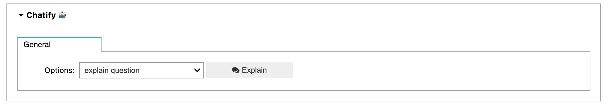

# Instructions to use `chatify` package

## Installing chaitfy package

- To install the chatify package, add the following code the `# Imports` cell at the beginning of the notebook.
- After adding run the cell. This will install the required packages.

```python
!pip install -q gptcache
!pip install -q langchain
!pip install -q openai
!pip install -q git+https://github.com/HemuManju/chatify.git

%load_ext chatify
```

For example:

Before addition

```python
# Imports
import numpy as np
import matplotlib.pyplot as plt

from sklearn.linear_model import LogisticRegression
from sklearn.model_selection import cross_val_score
```

After addition

```python
# Imports
import numpy as np
import matplotlib.pyplot as plt

from sklearn.linear_model import LogisticRegression
from sklearn.model_selection import cross_val_score

!pip install -q gptcache
!pip install -q langchain
!pip install -q openai
!pip install -q git+https://github.com/HemuManju/chatify.git

%load_ext chatify
```

## Adding the `config.yaml` file

- Create a `config.yaml` file in the directory where the notebook is located
- Copy and add the following contents to the `config.yaml` file

```yaml
cache_config:
  cache: True
  caching_strategy: exact # or similarity
  cache_db_version: 0.1
  url: null

feedback: False

model_config:
  open_ai_key: null
  model: fake_model
  model_name: gpt-3.5-turbo # text-curie-001

chain_config:
  chain_type: default
```

- Repalce the `null` value of the `url` to the url given to you. Not no quotations are required.
- Similarly, add the open-ai key.
- Finally change the `model` value under `model_config` to `cached_model`.
- Note that if the `url` value is `null`, the `cached_model` just produces the response `This is a cached response`.
- After changing the `config.yaml` file should look like this:

```yaml
cache_config:
  cache: True
  caching_strategy: exact # or similarity
  cache_db_version: 0.1
  url: URL_GIVEN_TO_YOU

feedback: False

model_config:
  open_ai_key: OPEN_AI_KEY_GIVEN_TO_YOU
  model: cached_model
  model_name: gpt-3.5-turbo # text-curie-001

chain_config:
  chain_type: default
```

## Adding the `explain` command

- Choose any cell in the notebook and add `%%explain` command in the beginning and run the cell.
- A widget will pop as show below



- Click on the explain button to get the cached response.
- You can also choose differnt `options`

```note
  If you change anything in the code please run the cell again!
```